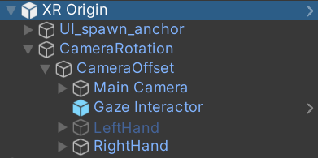
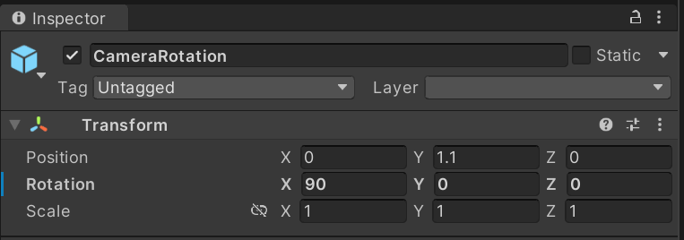
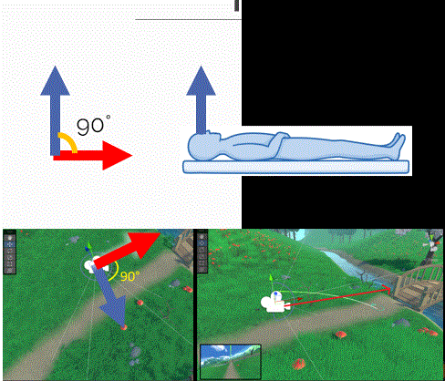

# XRI - XR Interaction Toolkit

In questo progetto viene utilizzato [`XR Interaction Toolkit (XRI)`](https://docs.unity3d.com/Packages/com.unity.xr.interaction.toolkit@2.4/manual/index.html), un framework sviluppato da Unity per facilitare la creazione di esperienze VR e realtà mista. XRI offre una serie di strumenti e componenti predefiniti che semplificano l'implementazione di interazioni VR/AR, come il teleport, la manipolazione di oggetti e molto altro. XRI è progettato per funzionare con una varietà di dispositivi e piattaforme XR, fornendo una soluzione unificata per lo sviluppo cross-platform di applicazioni immersive. Aiuta gli sviluppatori a gestire in modo efficiente gli input dell'utente, la fisica del mondo virtuale e altre complessità legate alla creazione di esperienze XR coinvolgenti.

Data la modularità e la flessibilità di questo framework, è stato possibile adattare i requisiti e i vincoli di progetto con più semplicità, limitando la stesura di codice.

Di seguito, verranno illustrati i principali componenti utilizzati e cosa è stato modificato a seconda delle esigenze progettuali.

[1. Complete Set Up](#complete-set-up)
[2. UI_spawn_anchor](#ui_spawn_anchor)

## Complete Set Up

L'oggetto `Complete Set Up` è un componente predefinito di XRI ed è un oggetto chiave per gestire la posizione e l'orientamento dell'utente nel mondo virtuale, l'input dell'utente al sistema e l'output.

Questo oggetto racchiude gli oggetti necessari per il corretto funzionamento del dispositivo VR con Unity.  
  
Gli oggetti selezionati sono il "core" dell framework, e gestiscono l'input e interazione con gli oggetti del mondo virtuale.

All'interno di questo prefab è presente l'oggetto [**XR Origin**](https://docs.unity3d.com/2021.3/Documentation/Manual/xr-origin.html). Questo prefab include i componenti necessari per l'input generale, l'interazione con gli oggetti, l'interazione con interfaccia utente e il sistema di movimento del Virtual Body.

Quando infatti il virtual body si muove nello spazio tridimensionale, l'oggetto che effettivamente si sposta nello spazio è proprio `XR Origin`.

### Camera Rotation

L'oggetto `Camera Rotation` (aggiunto) è l'oggetto padre che racchiude l'oggetto `Camera Offset` (originariamente presente), che a sua volta contiene gli elementi di base per il funzionamento dell'interazione con il mondo virtuale.

`Camera Rotation`, è infatti responsabile della rotazione del virtual body. 
Tramite questa rotazione si può intervenire per corregere la posizione di base dell'utente. In questo caso, l'utente ha una posizione base che prevede l' sguardo al soffitto.
.
Questo oggetto non è altro che un Offset di rotazione della Virtual Camera principale.

Impostare una rotazione di 0 gradi sull'asse x equivale a ripristinare XR Origin al suo valore di default.

## UI_spawn_anchor
Questo oggetto non è altro che un "segnaposto" per tutti quei messaggi di UI che devono comparire a schermo. Questo concetto viene approfondito in [Tutorial_intro](Tutorial_intro.md).