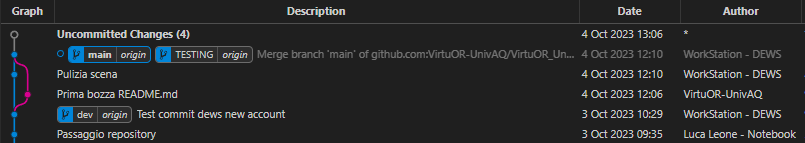
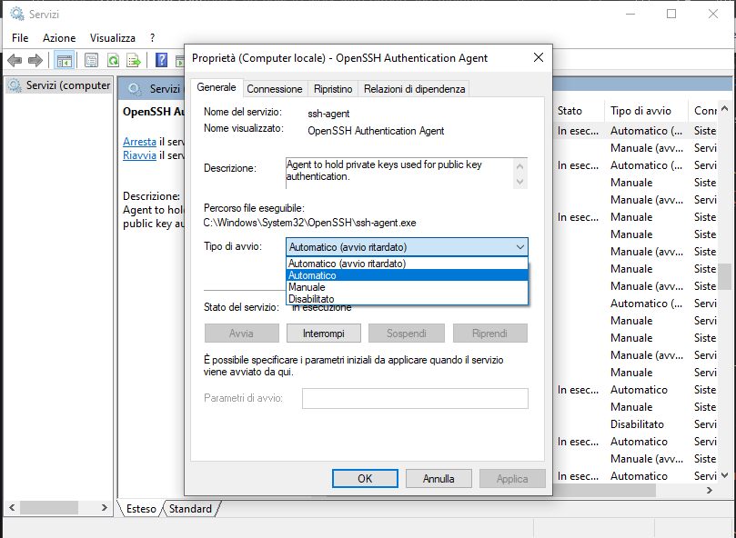
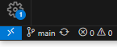
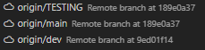

# Configurazione per il Version Control, l'utilizzo di Git e il setup di Visual Studio Code

In questa sezione si illustreranno i passaggi da seguire per poter lavorare con la repository su GitHub, in modo da poter salvare online le modifiche al progetto.

***!!!ATTENZIONE!!!*** è fortemente consigliato un primo approccio con i [file locali](../README.md#download-del-progetto-copia-locale), dal momento che il rischio di fallimento e di compromettere il progetto sono elevati.

Una volta presa la giusta dimestichezza, è possibile lavorare anche in remoto, seguendo attentamente le procedure che seguiranno.

## Version Control e Git

Per poter utilizzare il Version Control basterà scaricare [Git](https://git-scm.com/) ed installarlo sul proprio computer, lasciando tutte le scelte di default durante il processo di installazione.

Per assicurarsi che tutto sia andato a buon fine, basterà aprire il `Terminale` o il prompt dei comandi `cmd`, digitare

```console
git
```
e dare invio. L'helper di Git verrà stampato a schermo.

### Configurazione Git
Bisogna configurare Git affinchè venga riconosciuto l'utente che esegue le operazioni sul progetto. Basterà digitare
```console
git config --global user.name "Username a scelta"
```
e in seguito
```console
git config --global user.email "name@domain.example"
```

In questo modo, quando verrà effettuato un operazione da una posizione diversa dalla Workstation DEWS, sul [GitGraph](#version-control-e-git) verrà visualizzato correttamente il nome dell'utente.



A questo punto è possibile creare una cartella sul proprio Personal Computer dove in seguito risiederà l'intero progetto, e cambiare la posizione del `Terminale` in modo che punti a questa directory. Si consiglia di nominare la cartella `VirtuOR_UnityProject`, in modo da non avere futuri problemi

```console
C:\"tuo_percorso_directory"\VirtuOR_UnityProject>
```
Basterà dunque digitare il seguente comando
```console
git init  
```
Si avrà un output del tipo
```console
Initialized empty Git repository in C:/"tuo_percorso_directory"/VirtuOR_UnityProject/.git/
```

### Generazione della chiave SSH
1. Abilitare il servizio `OpenSSH Authentication Agent` ed avviarlo 
2. Aprire il `Terminale` o il prompt dei comandi `cmd`
3. Inserire `ssh-keygen -t rsa -b 4096 -C "virtuor.univaq@gmail.com"`
4. Inserire il nome da dare alla chiave (si consiglia il nome `ssh_key_virtuor`)
5. Dare doppio invio per non generare una password (lasciare dunque il campo vuoto)
5. Inserire `ssh-add ssh_key_virtuor`
6. Copiare i file generati (`ssh_key_virtuor` e `ssh_key_virtuor.pub`) nella directory del `Terminale` nella cartella `C:\Users\"tuo_nome_utente"\.ssh`
7. Aprire il file `ssh_key_virtuor.pub` con un editor di testo e copiare la chiave
8. Accedere con il browser all'indirizzo della repository VirtuOR di GitHub con le credenziali fornite dagli amministratori
9. Fare clic sul menu a discesa accanto all'immagine del profilo in alto a destra, selezionare Impostazioni e fare clic su "SSH and GPG Keys"
10. Aggiungere la chiave copiata in precedenza
11. Creare un file con nome `config` (senza estensione!!!), ed aprirlo con un editor di testo
12. Incollare nel file il seguente testo
```
Host github.com
    Hostname github.com
    User git
    IdentityFile ~/.ssh/ssh_key_virtuor
```
In questo modo, il Personal Computer è pronto ad effettuare operazioni remote sulla repository online di GitHub.


## Setup di Visual Studio Code

In questa sezione sono illustrati gli step da seguire per configurare [Visual Studio Code](https://code.visualstudio.com/).

### Step preliminari

Dopo aver scaricato ed installato VSCode, è possibile lavorare con il [Terminale integrato](https://code.visualstudio.com/docs/terminal/basics).

1. Aprire VSCode
2. Aprire la cartella `VirtuOR_UnityProject` creata precedentemente
3. Dal terminale di VSCode
    1. inserire `git remote add origin git@github.com:VirtuOR-UnivAQ/VirtuOR_UnityProject.git` (questo comando aggiungerà nel file di configurazione della cartella locale la repository online del progetto)
    1. inserire `git pull origin main` (questo comando scaricherà tutto il contenuto della repository)
    1. inserire `git branch --set-upstream-to=origin/main main` (in questo modo i branch locali vengono collegati con i branch online)
4. Per cambiare branch bisogna cliccare in fondo a sinistra, sulla scritta `main`  
    
    1. selezionare il branch `origin/dev`  
    
    1. inserire `git branch --set-upstream-to=origin/dev dev`
5. Ripetere l'operazione 4. per il branch `origin/TESTING`


Bisogna dunque salvare tutte le modifiche, e quindi salvare la scena e il progetto tramite il menu File dell’editor Unity. Questa sarà la versione di partenza del nostro progetto, dove troveremo:

### GitGraph