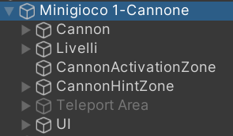
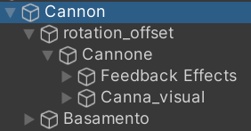
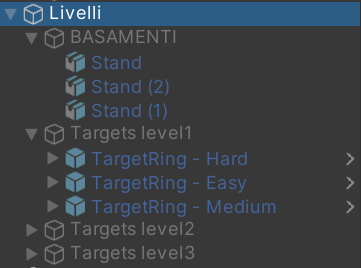
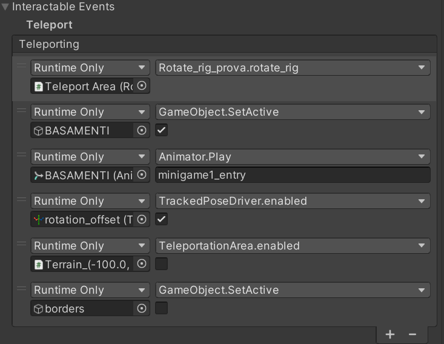
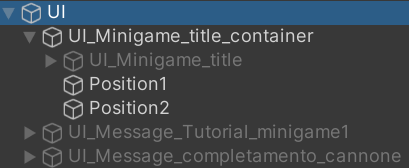
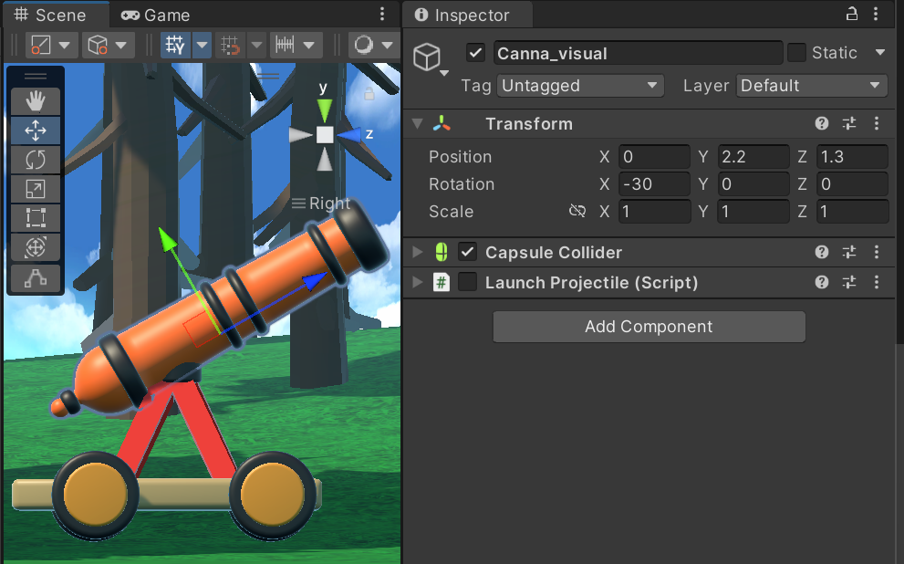
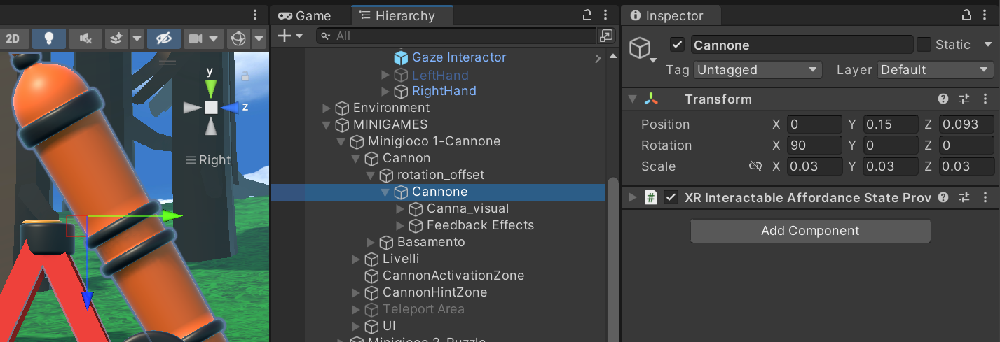
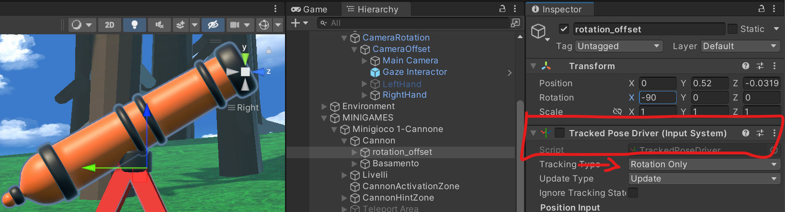

# Minigame 1: Cannone

In questa sezione verrà spiegato il funzionamento del Minigame 1, che altro non è che un tiro al bersaglio.

L'oggetto padre racchiude i componenti principali per il funzionamento del minigioco.
- **Cannon:** contiene gli elementi grafici e gli script necessari per il funzionamento del cannone.

- **Livelli:** contiene gli elementi grafici e gli script che consentono la logica a livelli del minigioco.

- **CannonActivationZone e CannonHintZone:** sono degli oggetti trigger invisibili che si attivano quando il virtual body entra nel in un predefinito Box Collider. Lo script che permette il funzionamento è il [`Toggle Component Zone`](#toggle-component-zone-script).
- **Teleport Area:** questo oggetto è un [`Teleportation Anchor`](https://docs.unity3d.com/Packages/com.unity.xr.interaction.toolkit@2.5/manual/teleportation-anchor.html). Quando l'utente si teletrasporta all'interno di quest'area, vengono richiamate le funzioni che danno inizio al minigioco (animzioni, attivazioni di componenti, ecc...).

- **UI:** Contiene gli elementi della User Interface che guidano l'utente.

## Cannon
Per poter spiegare la logica che garantisce una corretta rotazione del cannone, è necessario avere chiaro come il sistema di coordinate ragiona.

Visualmente, il cannone è conenuto nell'oggetto `Canna_visual`.  A questo è infatti applicata una leggera rotazione che lo inclina già dall'inizio verso i bersagli, per facilitarne il controllo. Questo oggetto, inoltre, contiene lo [script](#launch-projectile-script) che permette al cannone di sparare.
Per poter compensare la posizione dell'utente, proprio come è stato fatto per la Camera Rotation, bisogna applicare una rotazione di 90° sull'asse x ad un oggetto padre che contiene `Canna_visual`, in questo caso l'oggetto `Cannone`.

Come si può notare, il cannone assumerà ovviamente una posa visuale non desiderata. Per poter ripristinare la posizione corretta, è necessario ancora una volta applicare un offset di rotazione (-90°), aggiungendo un ulteriore oggetto padre (`rotation_offset`).

A questo ultimo oggetto si andrà ad applicare il Component `Tracked Pose Driver (Input System)`, che traccerà la sola rotazione dell'HMD.
Dal momento che, come spiegato prima, l'oggetto figlio compensa la posizione dell'utente, il cannone assumerà la posa desiderata. In questo caso, la rotazione di -30° applicata all'oggetto `Canna_visual`.

Inoltre, all'oggetto `rotation_offset`, per semplicità, è stato anche assegnato il Component `XR Simple Interactable`, che gestisce lo sparo.

## Livelli
L'oggetto `Livelli` racchiude gli oggetti che contengono le basi dei bersagli e i vari livelli del minigame.
Grazie allo script [`Toggle Components`](#toggle-components) è possibile triggerare le funzioni da richiamare quando gli eventi di attivazione e disattivazione vengono invocati.
La differenza tra i livelli è data dalle animazioni collegate ai bersagli. Infatti è possibile manipolare la velocità di movimento e la grandezza dei bersagli.

## CannonActivationZone e CannonHintZone
L'oggetto `CannonActivationZone` permette all'utente che si avvicina al cannone di ricevere le istruzioni per iniziare il minigioco. Grazie allo [script](#toggle-component-zone-script) vengono attivati gli elementi necessari al corretto funzionamento del minigioco.

## Teleport Area
L'oggetto contiene i bordi che delimitano visualmente i confini dell'area di teletrasporto, per poter guidare l'utente.
Inoltre, appena si esegue il teletrasporto, vengono richiamati due script che sono a loro volta collegati all'oggetto `Teleport Area`, e questi sono [`Prova_selection`](#prova_selection-script) e [`Rotate_rig_prova`](#rotate_rig_prova-script).

## UI
Nell'oggetto `UI` sono presenti i Canvas che guidano attraverso i tutorial l'utente. Inoltre, all'interno di questi oggetti sono presenti anche i bottoni che l'utente preme, per confermare l'inizio del minigame.
Lo script [`Move Object At Position`](#move-object-at-position-script) permette di spostare l'oggetto a cui esso è associato tramite gli Unity Events.

## Descrizione degli script

In questa sezione verranno descritti gli script utilizzati per il corretto funzionamento del Minigame 1.

### Toggle Component Zone Script

### Launch Projectile Script

### Toggle Components Script

### Prova_selection Script

### Rotate_rig_prova Script

### Move Object At Position Script